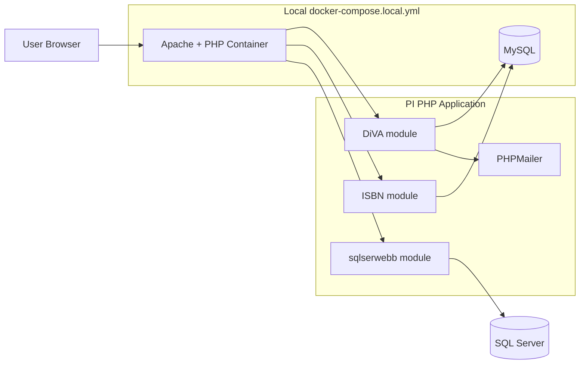
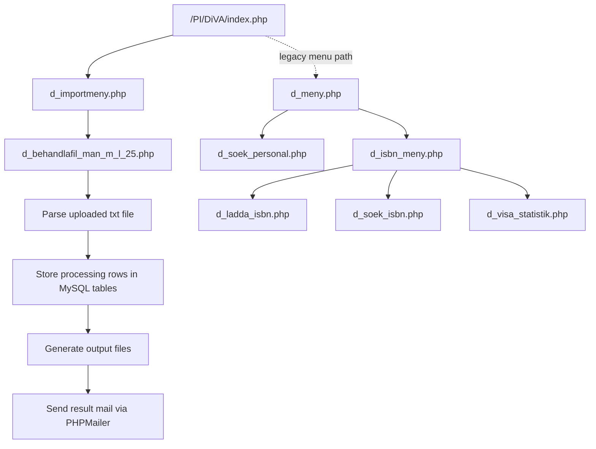
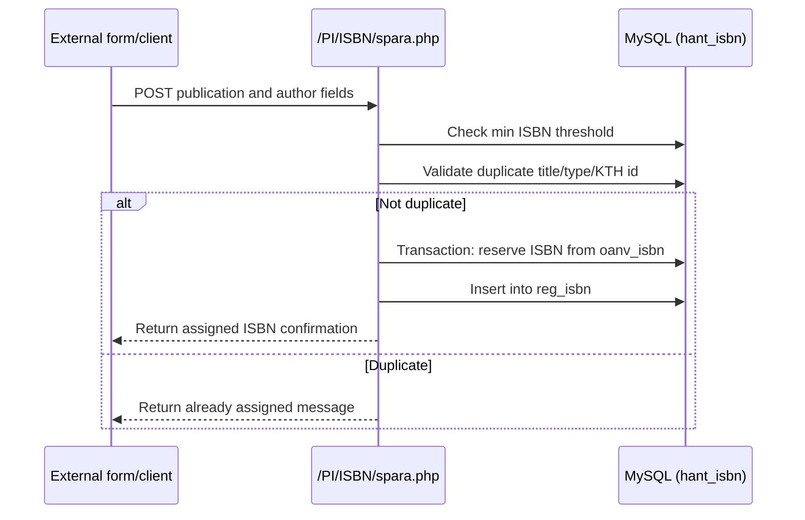
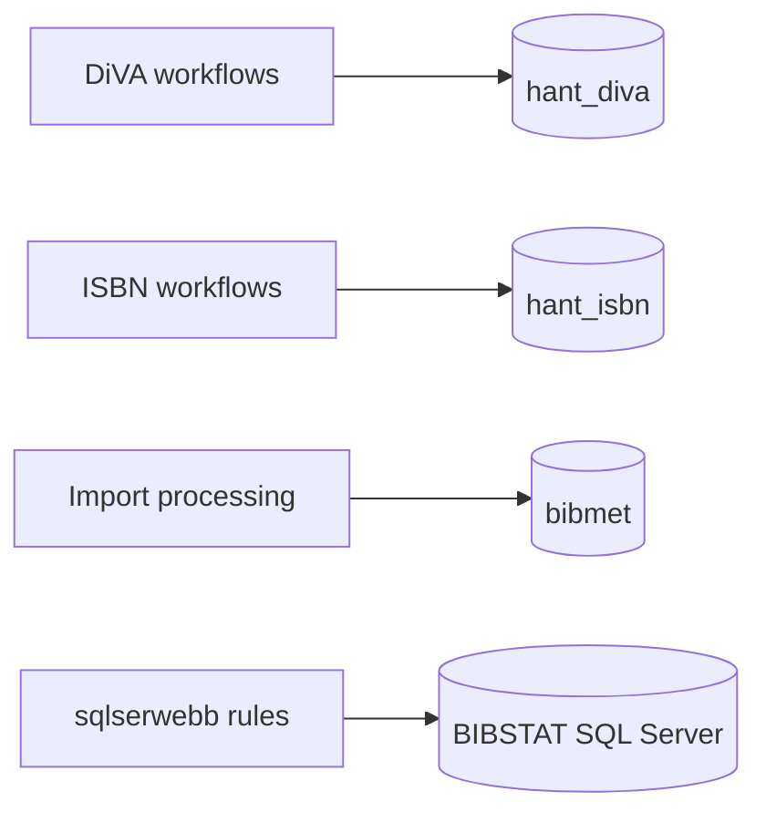

# PI Project Guide and Flow

## What this project is about

PI is a legacy PHP web application used by KTH Library to support publishing-related workflows.

Main business areas:
- DiVA import processing (file-based workflow)
- ISBN handling (register/search/statistics)
- KTH staff lookup support
- Address correction/rule management in the sqlserwebb module

The system runs in Docker and uses MySQL for DiVA/ISBN/BIBMET-related tables.
Some modules in sqlserwebb also connect to Microsoft SQL Server through PDO sqlsrv.

## Main modules

- src/PI/DiVA
  - Main entry for menu and import workflows
  - Uses MySQL databases such as hant_diva, hant_isbn, and bibmet
- src/PI/ISBN
  - ISBN registration endpoints and related actions
  - Uses MySQL (hant_isbn)
- src/PI/sqlserwebb
  - Address/rule management area
  - Uses SQL Server (PDO sqlsrv) in many scripts
- dbinit
  - SQL initialization scripts for local MySQL startup
  - bibmet.sql, hant_diva.sql, hant_isbn.sql

## High-level architecture

## Navigation flow (typical)

## ISBN registration flow

## Data stores used in PI

## Local runtime model

For local development, the repository includes:

- docker-compose.local.yml
- Dockerfile.local

Why this matters:

- Local profile skips SQL Server ODBC installation to avoid build issues with old package sources.
- DiVA/ISBN/MySQL flows work locally.
- sqlserwebb pages that require SQL Server connectivity may not fully work unless SQL Server access is available and configured.

## Key entry points

- DiVA menu: /PI/DiVA/index.php
- Import menu: /PI/DiVA/d_importmeny.php
- Legacy main menu: /PI/DiVA/d_meny.php
- ISBN menu: /PI/DiVA/d_isbn_meny.php
- sqlserwebb login: /PI/sqlserwebb/loggain.php

## Quick understanding summary

- PI is a multi-workflow PHP app, not a single API service.
- Most local functionality depends on MySQL and dbinit scripts.
- sqlserwebb is the main part that depends on SQL Server.
- The primary current start page leads into the DiVA import flow.
